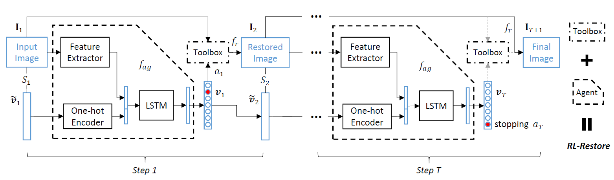
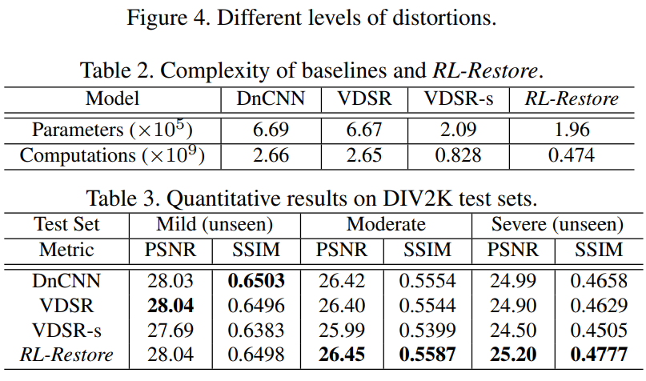

# 视频增强


## 内容
1. [增强模型](#增强模型)
2. [前期准备](#前期准备)
3. [训练](#训练)
4. [测试](#测试)
5. [结果](#结果)

## 增强模型

### Restore

- Framework




## 前期准备
### 1. 云脑上选择镜像
```
172.168.202.50:5000/user-images/wangshsh
```

如果要进行训练，则还需要安装`matlab`


## 训练
### 1. 数据集下载
- 数据集下载地址 [Baidu Cloud](https://pan.baidu.com/s/1RXTcfI-mne5YZh3myQcjzQ)
- 移动数据集到`data/train`目录下

### 2. 生成训练数据
- matlab下运行`data/train/generate_train.m`, 生成hdf5格式的训练数据
- 生成的`.h5`文件在`data/train`目录下

### 3. 修改训练参数
- 训练参数在`config.py`中

### 4. 开始训练
- 运行命令
```
python main.py --is_train True
```


## 测试
- 放置待增强视频到`./input`目录下，该目录下已放一个待增强视频datouerzi.mp4
- 执行命令
```
python test_video.py --input_name input/input.mp4 --output_name results/output.mp4
```
在上述命令中，input.mp4为待增强的视频文件名，增强后的结果视频保存在`./results`目录下，文件名为output.mp4


## 结果
- 与其他算法的比较



- 对datouerzi.mp4进行增强后的结果对比

